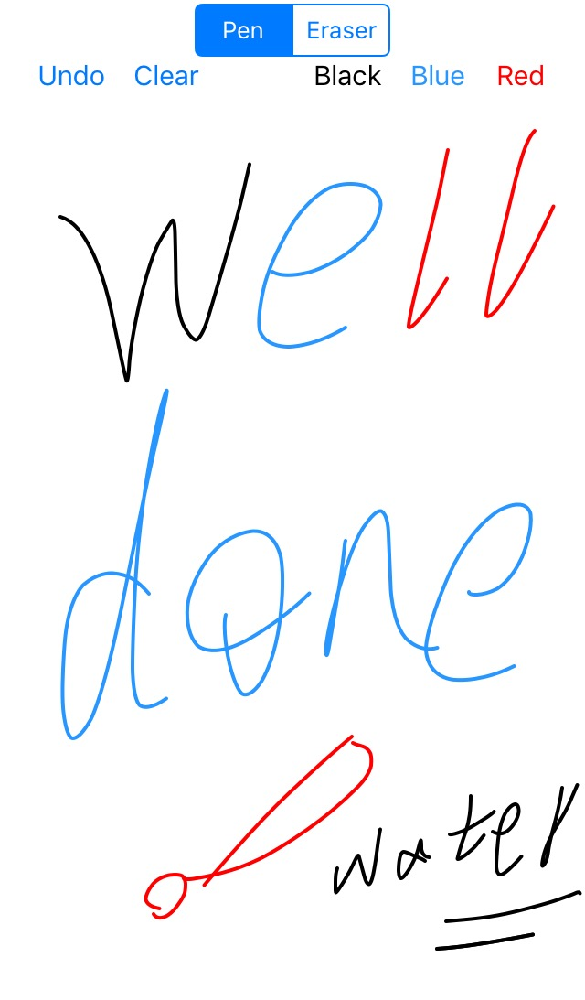

# WTDrawing
A simple way to draw smooth line on iOS.
## Screenshot

## Features
* Change stroke color
* Change stroke width
* Undo
* Clear all drawings
* Eraser drawing
* Get snapshot

## Usage
Just dragging `WTBezierPath` and `WTDrawingView` into projects, then do what you want.
### Init
~~~objc
self.drawingView = [[WTDrawingView alloc] initWithFrame:self.view.bounds];
~~~
### Undo
~~~objc
[self.drawingView undo];
~~~
### Clear all drawings
~~~objc
[self.drawingView clear];
~~~
### Draw eraser
~~~objc
self.drawingView.eraserMode = YES;
~~~
### Change stroke width
Default stroke width is 2.0.

~~~objc
self.drawingView.strokeWidth = 5.0;
~~~
### Change stroke color
Default stroke color is black.

~~~objc
self.drawingView.strokeColor = [UIColor redColor];
~~~
### Change eraser stroke width
Default eraser width is 20.

~~~objc
self.drawingView.eraserWidth = 20.0f;
~~~